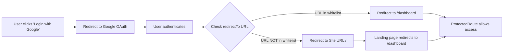

# Supabase OAuth Redirect URL Configuration

## Issue
Setelah berhasil login via Google OAuth, user di-redirect ke landing page (`https://www.gudangku.space/`) instead of dashboard (`https://www.gudangku.space/dashboard`).

## Root Cause
URL `https://www.gudangku.space/dashboard` belum ditambahkan ke **Redirect URLs whitelist** di Supabase Dashboard. Ketika `redirectTo` URL tidak ada di whitelist, Supabase akan default redirect ke "Site URL" (biasanya root `/`).

## Solution Steps

### 1. Login ke Supabase Dashboard
Buka [https://supabase.com/dashboard](https://supabase.com/dashboard) dan login dengan akun Anda.

### 2. Navigate to Authentication Settings
1. Pilih project Anda (yang digunakan untuk Gudangku)
2. Di sidebar kiri, klik **Authentication**
3. Klik tab **URL Configuration**

### 3. Add Redirect URLs
Pada bagian **Redirect URLs**, tambahkan URL berikut:

```
https://www.gudangku.space/dashboard
http://localhost:5000/dashboard
```

**Penjelasan:**
- `https://www.gudangku.space/dashboard` - untuk production
- `http://localhost:5000/dashboard` - untuk local development

### 4. Verify Site URL
Pastikan **Site URL** di-set ke:
```
https://www.gudangku.space
```

### 5. Save Changes
Klik tombol **Save** di bagian bawah halaman.

---

## Expected Behavior After Fix

✅ **Before:** Login → Redirect ke `/` (landing page)  
✅ **After:** Login → Redirect ke `/dashboard` (stays there)

---

## Additional Notes

### OAuth Callback Flow


### Why This Happens
Supabase validates all OAuth redirect URLs against the whitelist untuk security reasons. Ini mencegah attacker dari:
- Redirect users ke malicious sites
- Stealing OAuth tokens
- Phishing attacks

### Testing After Configuration
1. Clear browser cache/cookies
2. Navigate to https://www.gudangku.space/login
3. Click "Masuk dengan Google"
4. Complete Google authentication
5. **Verify:** You land on `https://www.gudangku.space/dashboard` and stay there

---

## Screenshot Guide

### Where to Find URL Configuration

**Step 1:** Authentication tab


**Step 2:** Add Redirect URLs
```
┌─────────────────────────────────────────────────┐
│ URL Configuration                               │
├─────────────────────────────────────────────────┤
│                                                 │
│ Site URL                                        │
│ https://www.gudangku.space                      │
│                                                 │
│ Redirect URLs                                   │
│ https://www.gudangku.space/dashboard            │
│ http://localhost:5000/dashboard                 │
│                                                 │
│ [Add URL]                                       │
│                                                 │
│                               [Save]            │
└─────────────────────────────────────────────────┘
```

---

## Code Changes Already Deployed

Sudah ada fallback logic di `Landing.tsx` yang akan redirect authenticated users ke dashboard:

```typescript
// Landing.tsx
useEffect(() => {
  if (!loading && user) {
    navigate("/dashboard", { replace: true });
  }
}, [user, loading, navigate]);
```

Jadi meskipun Supabase redirect ke `/`, landing page akan otomatis redirect ke `/dashboard`.

---

## Next Steps

1. ✅ Update Supabase Redirect URLs (following steps above)
2. ✅ Deploy latest frontend code (includes Landing page redirect)
3. ✅ Test login flow in production
4. ✅ Verify user stays on dashboard after login
